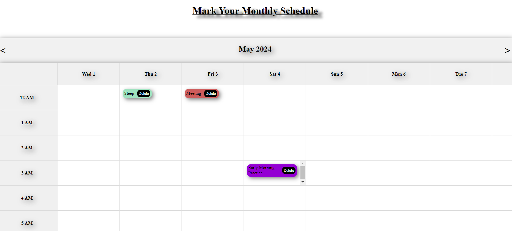
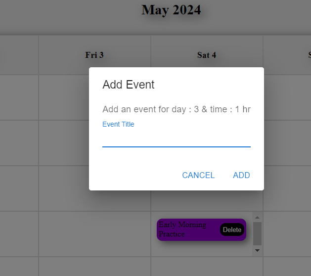

# React Drag-and-Drop Calendar

A React-based calendar application with drag-and-drop functionality for scheduling events. The application allows users to add, delete, and drag events across different days and times within a monthly view. It also highlights the current date and persists event data using local storage.

## Features

- **Monthly Calendar View**: Displays days and times in a scrollable grid format.
- **Event Management**: Add, delete, and drag-and-drop events.
- **Highlight Today's Date**: Automatically highlights the current date.
- **State Persistence**: Saves and retrieves events from local storage.
- **Responsive Design**: Calendar grid adjusts to different screen sizes.
- **Material UI**: Utilizes Material UI for the event form dialog.

## Installation

1. **Clone the repository:**
   ```bash
   git clone https://github.com/ayushtiwari31/React-Scheduler.git
   cd react-drag-and-drop-calendar


2. **Install dependencies:**

    ```bash
    npm install
    npm i react-dnd react-dnd-html5-backend @emotion/react @emotion/styled @mui/material
    ```

3. **Start the development server:**

    ```bash
    npm start
    ```

4. **Open your browser:**
    Navigate to [http://localhost:3000](http://localhost:3000) to see the calendar application.


## Hosted Application

You can view the hosted application at: [https://react-scheduler-one.vercel.app/](https://react-scheduler-one.vercel.app/)


## Usage

### Adding an Event

1. Click on any calendar cell corresponding to a day and time.
2. Fill in the event title in the popup form.
3. Click "Submit" to add the event to the calendar.

### Deleting an Event

1. Click on an event within the calendar cell.
2. Confirm the deletion in the popup dialog.

### Dragging and Dropping an Event

1. Click and hold an event to drag it.
2. Move the event to the desired day and time cell.
3. Release the mouse button to drop the event in the new cell.


## Screenshots



*Screenshot of the main calendar view.*




*Screenshot of the event form.*


## Assignment Reflection

### 3 Things I Learned from this Assignment

1. **State Management**: Handling complex state management with nested data structures in React.
2. **Drag-and-Drop Implementation**: Using the `react-dnd` library to implement drag-and-drop functionality.
3. **Material-UI Integration**: Integrating and customizing Material-UI components within a React application.

### The Most Difficult Part of the Assignment

The most challenging part was implementing the drag-and-drop functionality for events, ensuring that events could be moved across different days and times without losing their data integrity.

### What I Would Have Done Differently Given More Time

Given more time, I would have tried to implement additional features such as recurring events, a weekly view for more detailed scheduling, the ability to edit existing events directly within the calendar and to send notifications to user about the events.